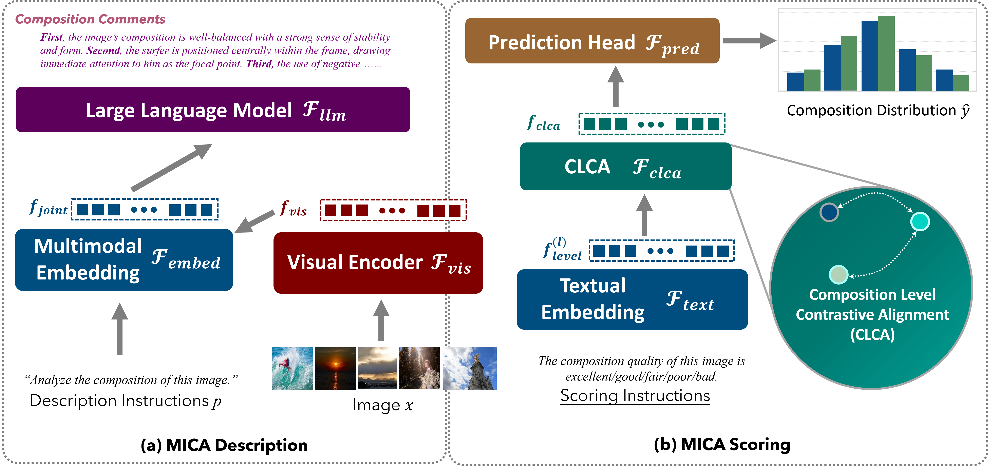

  <h1>Towards Explainable Image Composition Assessment:  a Dataset and a Model</h1>

  

      
  

---

## News

- **2016.01.05**
Jupyter Notebook demonstration released.
  👉 Please click **[this](MICA_inference_demo_release_260105.ipynb)** to view the inference results.

> The notebook contains fully rendered images and corresponding model outputs.  
> All results were generated offline and saved directly in the notebook.

---

